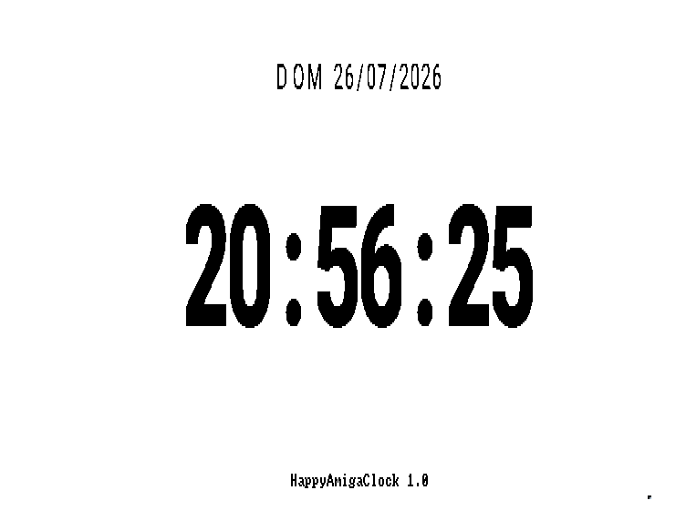
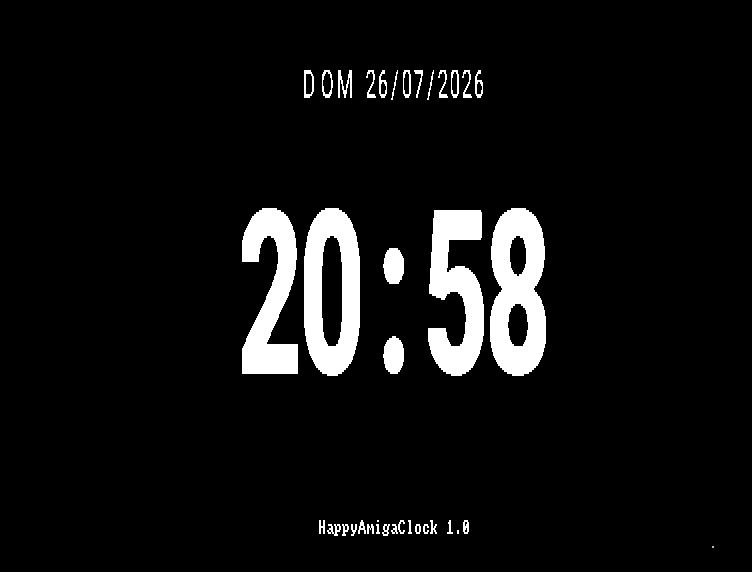
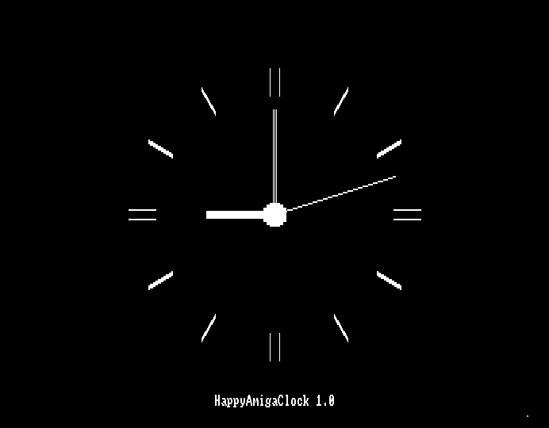

# Happy Amiga Clock

Happy Amiga Clock è un orologio a schermo intero per Commodore Amiga,
scritto in C usando direttamente le API di AmigaOS.

Il progetto prende ispirazione da
[HappyPlusClock](https://www.gryphel.com/c/sw/general/hapclock/), ma non
è un semplice porting: è una reimplementazione completa e indipendente,
progettata appositamente per sfruttare le API di AmigaOS e le
caratteristiche hardware del Commodore Amiga.

Il progetto è servito anche come palestra per prendere dimestichezza con
la cross-compilazione e con tecniche di sviluppo moderne, compreso
l'utilizzo dell'intelligenza artificiale, applicate a un ambiente di
sviluppo che ha come target una piattaforma hardware e software di oltre
trent'anni fa.

Versione corrente: **1.0** (`26.07.2026`).

Mostra l'ora e la data al centro dello schermo Workbench con un font
monocromatico incorporato nell'eseguibile. Le cifre vengono trasferite
tramite il blitter con `BltTemplate()`: non sono richiesti font installati
sull'Amiga e il ridisegno rimane rapido anche su un Motorola 68000.

Caratteristiche tecniche principali:

- compatibilità con Kickstart 1.3;
- avvio da Shell oppure tramite icona Workbench;
- visualizzazione opzionale dei secondi;
- modalità analogica a tutto schermo;
- giorno della settimana abbreviato sulla riga della data;
- separatore lampeggiante nel formato senza secondi;
- inversione automatica bianco/nero secondo un periodo di tempo prestabilito;
- puntatore del mouse nascosto dopo 10 secondi di inattività;
- nome e versione mostrati in basso finché il puntatore è visibile;
- aggiornamento dei soli caratteri modificati;
- uscita con un click sinistro, tramite Esc o, da Shell, con Ctrl+C;
- bitmap del font conservate in CHIP RAM e accessibili direttamente al
  blitter.
- segnale orario acustico al cambio dell'ora

L'eseguibile contiene il tag standard:

```text
$VER: HappyAmigaClock 1.0 (26.07.2026)
```

La versione può quindi essere interrogata con il comando AmigaDOS
`Version` sui sistemi che lo supportano.

## Screenshot

### Orologio digitale — modalità chiara



### Orologio digitale — modalità scura



### Orologio analogico — modalità scura



## Configurazione

Le opzioni `SECONDS`, `INVERT`, `MODE`, `DATEALWAYS`, `CHIME` e `ANALOG`
controllano il formato, l'alternanza dei colori, la visibilità della
data e il segnale orario.

Per tutte le opzioni `YES|NO` sono accettati anche i valori equivalenti
`ON|OFF` e `TRUE|FALSE`.

### `SECONDS`

Controlla la visualizzazione dei secondi.

| Valore | Risultato |
| --- | --- |
| `SECONDS=YES` | Mostra `hh:mm:ss` |
| `SECONDS=NO` | Mostra `hh:mm` con separatore lampeggiante |

**Valore predefinito:** `SECONDS=YES`.

In modalità analogica determina se mostrare o nascondere la lancetta dei
secondi.

### `INVERT`

Stabilisce ogni quanti minuti scambiare i colori dello sfondo e
dell'orologio.

| Valore | Risultato |
| --- | --- |
| `INVERT=0` | Disabilita l'inversione automatica |
| `INVERT=<minuti>` | Inverte i colori all'intervallo indicato, da 1 a 65535 minuti |

**Valore predefinito:** `INVERT=720`, cioè ogni 12 ore.

L'intervallo parte dal minuto in cui viene avviato il programma e il
cambio avviene al passaggio a un nuovo minuto.

### `MODE`

Sceglie la combinazione di colori iniziale.

| Valore | Risultato |
| --- | --- |
| `MODE=LIGHT` | Sfondo bianco e testo nero |
| `MODE=DARK` | Sfondo nero e testo bianco |

**Valore predefinito:** `MODE=LIGHT`.

Con `INVERT=0` la combinazione scelta rimane invariata.

### `DATEALWAYS`

Stabilisce il comportamento della data dopo l'inattività del mouse.

| Valore | Risultato |
| --- | --- |
| `DATEALWAYS=NO` | Nasconde la data dopo 10 secondi di inattività e la ripristina al movimento del mouse |
| `DATEALWAYS=YES` | Mantiene la data sempre visibile |

**Valore predefinito:** `DATEALWAYS=NO`.

Questa opzione non ha effetto in modalità analogica, nella quale la data
non viene visualizzata.

### `CHIME`

Controlla il segnale acustico a due note allo scoccare di ogni ora.

| Valore | Risultato |
| --- | --- |
| `CHIME=NO` | Disabilita il segnale orario |
| `CHIME=YES` | Riproduce il segnale orario |

**Valore predefinito:** `CHIME=NO`.

Il suono viene generato dal programma e riprodotto tramite
`audio.device`, senza richiedere file esterni.

### `ANALOG`

Sceglie il tipo di quadrante.

| Valore | Risultato |
| --- | --- |
| `ANALOG=NO` | Mostra l'orologio digitale e la data |
| `ANALOG=YES` | Mostra il quadrante analogico a tutto schermo |

**Valore predefinito:** `ANALOG=NO`.

In modalità analogica la data non viene sovrapposta al quadrante.

### Avvio dalla Shell

Su AmigaOS 2.0 o successivo gli argomenti vengono analizzati con
`ReadArgs()`:

```text
HappyAmigaClock ANALOG=YES SECONDS=YES INVERT=60 MODE=DARK CHIME=YES
```

`ReadArgs()` non è disponibile su Kickstart 1.3. In quel caso il programma
parte comunque, ignorando gli argomenti e usando la configurazione
predefinita.

### Avvio da Workbench

Aprire la finestra delle informazioni dell'icona e aggiungere ai ToolTypes:

```text
SECONDS=NO
INVERT=60
MODE=DARK
DATEALWAYS=YES
CHIME=YES
ANALOG=YES
```

I ToolTypes vengono letti tramite `icon.library` e `FindToolType()`.

## Requisiti per la compilazione

- [VBCC](http://sun.hasenbraten.de/vbcc/) con target `m68k-kick13`;
- VASM e VLink inclusi nell'installazione VBCC;
- header NDK AmigaOS;
- GNU Make.

I percorsi predefiniti sono definiti in [Makefile](Makefile):

```make
VBCC_ROOT ?= /Users/mark/Developer/Amiga/vbcc
NDK_INC ?= /Users/mark/Developer/Amiga/sdk/NDK_3.9/Include/include_h
```

Possono essere modificati nel file oppure sovrascritti dalla riga di
comando.

## Compilazione

Per produrre l'eseguibile e copiarne l'icona nella directory di
distribuzione:

```sh
make
```

I file risultanti sono:

```text
dist/HappyAmigaClock
dist/HappyAmigaClock.info
```

Per creare un archivio di distribuzione contenente entrambi i file:

```sh
make lha
```

L'archivio risultante viene scritto in
`dist/HappyAmigaClock.lha`.

Per eliminare i prodotti della compilazione:

```sh
make clean
```

Per compilare e avviare FS-UAE con la configurazione inclusa nel progetto:

```sh
make run
```

Per analizzare il codice C con Clang e trattare tutti gli avvisi come
errori:

```sh
make lint
```

Per applicare automaticamente lo stile definito in `.clang-format` a
tutti i sorgenti C e agli header:

```sh
make format
```

I percorsi di FS-UAE, del floppy di boot e della configurazione
dell'emulatore possono essere sovrascritti tramite le variabili definite
all'inizio del `Makefile`.

## Modificare le dimensioni del font

Il font non viene scalato durante l'esecuzione. Il progetto contiene tre
serie di bitmap native:

| Serie | Uso | Cella | Avanzamento |
| --- | --- | ---: | ---: |
| `compact` | Ora senza secondi, `hh:mm` | 52×88 px | 62 px |
| `large` | Ora con secondi, `hh:mm:ss` | 36×64 px | 40 px |
| `small` | Data | 16×24 px | 18 px |

La cella indica la larghezza e l'altezza massime di un carattere.
L'avanzamento è la distanza orizzontale tra l'origine di due caratteri
consecutivi.

### 1. Modificare le dimensioni generate

Aprire `tools/generate_font_bitmap.py` e cambiare la tabella `sizes`:

```python
sizes = (
    ("compact", 52, 88),  # hh:mm
    ("large", 36, 64),    # hh:mm:ss
    ("small", 16, 24),    # data
)
```

Il generatore conserva le proporzioni originali del glifo: la larghezza
della cella non stira il carattere, ma stabilisce lo spazio disponibile
per centrarlo.

### 2. Aggiornare le metriche centralizzate

Riportare le stesse larghezze e altezze in `include/font.h` e scegliere
l'avanzamento desiderato:

```c
#define FONT_ROW_BYTES(width) ((((width) + 31) / 32) * 4)

#define FONT_COMPACT_WIDTH    56
#define FONT_COMPACT_HEIGHT   88
#define FONT_COMPACT_ADVANCE  62

#define FONT_LARGE_WIDTH      44
#define FONT_LARGE_HEIGHT     72
#define FONT_LARGE_ADVANCE    48

#define FONT_SMALL_WIDTH      18
#define FONT_SMALL_HEIGHT     18
#define FONT_SMALL_ADVANCE    12
#define FONT_SMALL_LETTER_ADVANCE 18
#define FONT_SMALL_SPACE_ADVANCE  8
```

`font.c` e `render.c` condividono queste definizioni; non è necessario
modificare altre costanti nel codice C. `FONT_ROW_BYTES()` calcola
automaticamente il numero di byte occupati da una riga, arrotondato a
gruppi di 32 bit:

```text
((larghezza + 31) / 32) × 4
```

### 3. Controllare la larghezza complessiva

La larghezza di una stringa è:

```text
(numero caratteri - 1) × avanzamento + larghezza cella
```

Per esempio, con le dimensioni attuali:

```text
hh:mm:ss = 7 × 48 + 44 = 380 pixel
hh:mm    = 4 × 62 + 56 = 304 pixel
```

Prima di aumentare una dimensione è importante confrontare il risultato
con la larghezza della modalità video usata, altrimenti le cifre verranno
tagliate ai bordi. La data usa avanzamenti differenti per cifre, lettere
e spazi, quindi la sua larghezza viene calcolata carattere per carattere.

### 4. Rigenerare le bitmap

La rigenerazione richiede Python 3, [Pillow](https://python-pillow.org/) e
uno o più font TTF, OTF oppure TTC. Il generatore permette di scegliere
separatamente il font dell'orario e quello della data:

Eseguire:

```sh
python3 tools/generate_font_bitmap.py
make clean
make
```

Per usare stili differenti:

```sh
python3 tools/generate_font_bitmap.py \
  --time-font /percorso/RobotoCondensed_Bold.ttf \
  --date-font /percorso/Roboto_Regular.ttf
```

Con un file TTC contenente più varianti, `--time-face` e `--date-face`
selezionano l'indice della face desiderata:

```sh
python3 tools/generate_font_bitmap.py \
  --time-font /percorso/Helvetica.ttc --time-face 2 \
  --date-font /percorso/Helvetica.ttc --date-face 0
```

Le opzioni `--time-threshold` e `--date-threshold`, comprese tra 0 e 255,
regolano indipendentemente la conversione in monocromatico. Un valore più
basso tende a produrre tratti più pieni; uno più alto tratti più sottili.
Il valore predefinito è 112 per entrambi.

L'elenco completo delle opzioni è disponibile con:

```sh
python3 tools/generate_font_bitmap.py --help
```

Il generatore riscrive `src/font_bitmap.inc`, che contiene le maschere
monocromatiche compilate direttamente nell'eseguibile.

## Struttura del progetto

```text
assets/       icona Workbench e anteprime
emulator/     configurazione FS-UAE e floppy di sviluppo
include/      header del programma
src/          implementazione e bitmap incorporate
tools/        generatore del font
dist/         eseguibile e icona prodotti dalla build
```

I moduli principali sono:

- `config.c`: configurazione Shell e Workbench;
- `clock.c`: lettura e formattazione di data e ora;
- `font.c`: gestione delle bitmap e trasferimento tramite blitter;
- `render.c`: disposizione e aggiornamento selettivo dei caratteri;
- `timer.c`: aggiornamenti asincroni tramite `timer.device`;
- `window.c`: finestra Intuition a schermo intero.

## Licenza

Il codice del progetto è distribuito secondo i termini contenuti nel file
[LICENSE](LICENSE). Le bitmap incluse per impostazione predefinita sono
generate da Roboto Light, Copyright 2011 Google Inc., distribuito con
licenza Apache 2.0. Chi rigenera le bitmap con altri font deve verificarne
la relativa licenza.
